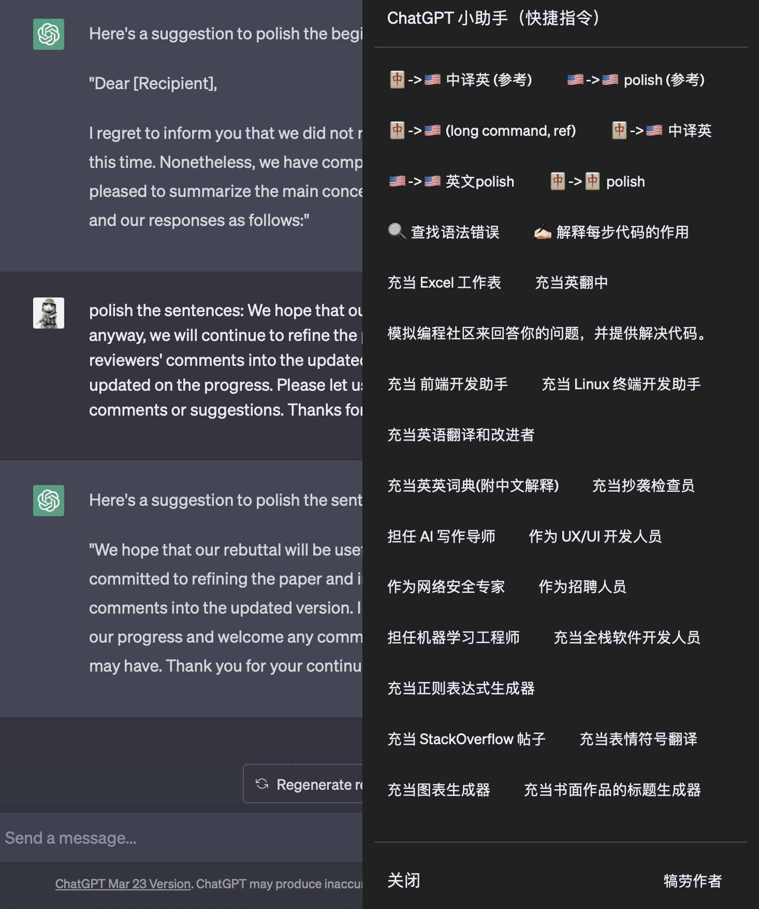
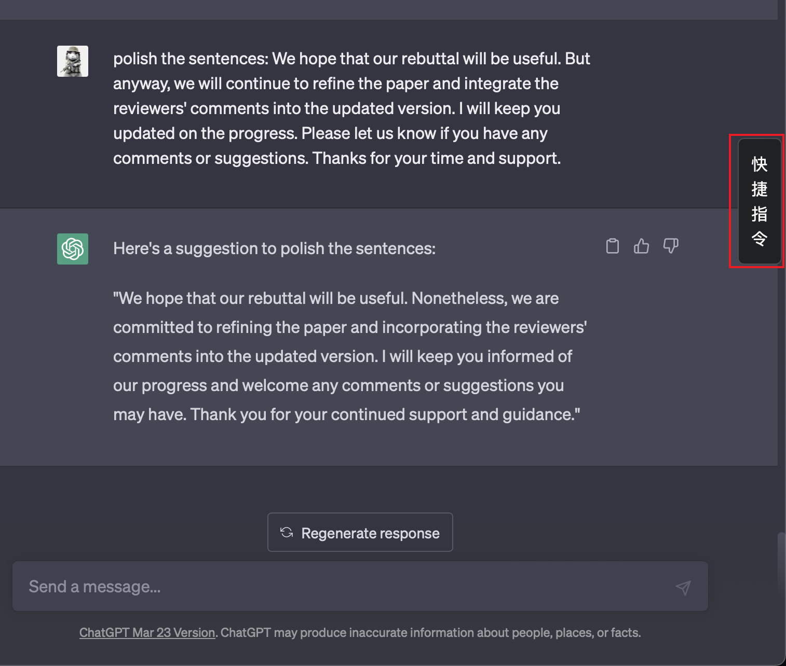

# Chatgpt Academic Helper: ChatGPT 学术小助手 (ChatGPT Academic Prompt Helper)

本项目是一个油猴脚本 (Tampermonkey)，旨在便于**网页版** Chatgpt 的 prompt 输入，并内置了一些常用的学术 prompt 模板。

本项目根据 [ChatGPT 插件脚本](https://github.com/winchesHe/chatGPT-prompt-scripts) 修改，主要自用。

<!--  -->

## Install:

将 `chatgpt_academic_helper.js` 文件下载下来，并拖入油猴脚本插件即可。

或手动新建油猴脚本 并粘贴 `chatgpt_academic_helper.js` 的内容。

## Usage:

### 打开 prompt 面板:

<!--  -->

单击侧边栏的 “快捷指令” 按钮，或者用快捷键 `command+shift+F` (Windows 用户使用 `ctrl+shift+F`)。

### 输入 prompt:

单击想要输入的 prompt 即可。prompt 会添加在输入框之前。

### 关闭 prompt 面板:

使用快捷键 `command+shift+F`, 或是按下 `ESC` 按键即可。

### 自定义 prompt:

自行修改 `chatgpt_academic_helper.js` 文件中的内容即可。

## 赞助:

如果你觉得脚本好用，可以请作者喝一杯咖啡：

